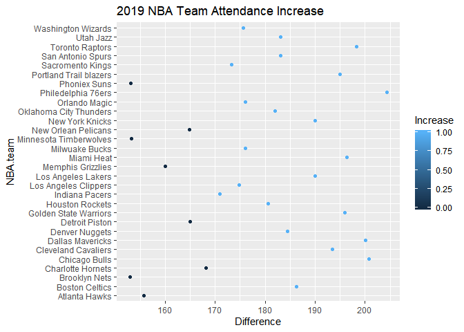
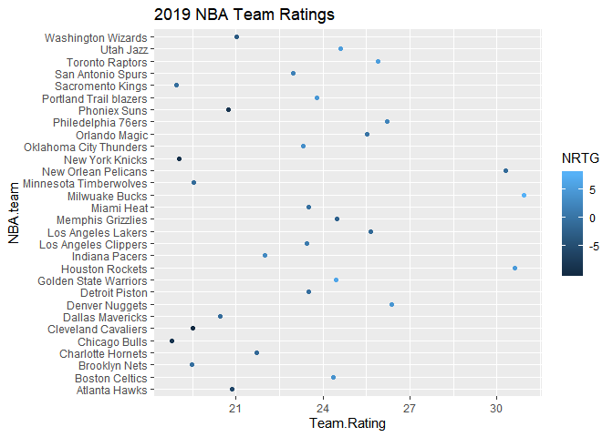

Introduction
------------

Data science and analytics has become more prevalent and has increased
rapidly in the past decade. With this increase sports analytics is
playing a more crucial role in the sports industry. Professional leagues
such as the National Basketball Association (NBA) have utilized on court
analytics to increase player and team performance, while management
utilizes off-field analytics to get a better understanding or insight of
the business side of their franchise. As a direct indicator of ticket
sales, attendance is an important area to study. Many factors affect
attendance, but the influence of each factor is different. The purpose
of this research project is to determine the team rating a team require
to guarantee a 1% home game attendance increase of 179 people per
season. Information from my project will be helpful for the NBA owners
and other professional and semiprofessional leagues. The clients that
this project will deal with will begin with NBA sport teams then towards
other leagues such as football and etc. Clients will be interested in
this project because of how the potential increase in value can attract
larger big ticket players to their organization. The data information
involved in the project includes the 2018-2019 NBA teams home game
attendance data, the 1% increase of the home game attendance, the
percent of attendance increase, the team rating, and the net rating
(NRTG). The approach that will be taken in regards of solving the
problem is after analyzing all the data gathered and then data wrangling
it. We then created the best linear regression model to predict the most
effective team rating required for teams to pass that 1% attendance
increase threshold. The deliverables of the project will be presented on
a blog summarizing everything that the project contains. The goal of
this project is to determine the required team rating required for a 1%
increase in team attendance.

NBA.team - the person that taught the class 2018-2019 season home game
attendance - the home game attendance from the 2018-2019 season that the
data comes from. 1 percent increase of attendance - the 1% increase of
the 2018-2019 season home game attendance Difference - the difference
from the the 1 percent increase and the original attendance data.
Percentage Increase - displays the percentage amount that the attendance
increased by from 1% increase NRTG - teams net rating which are made up
from their offensive and defensive rating from the 2018-2019 season.
Team.Rating - the teams rating is made up of the highest player
efficiency rating (PER) on that team. Increase - displays the teams that
did or did not pass the 179 average people threshold after the 1%
attendance increase

The necessary libraries needed for the project has been installed and
are loaded here.

``` r
library(tidyverse)
library(readr)
library(ggplot2)
library(caret)
library(rmarkdown)
```

All of the packages are loaded. Therefore, we load the data into R and
call the data frame attendance.

``` r
cleannew <- read.csv("teamAttendance5.csv")
glimpse(cleannew)
```

    ## Observations: 30
    ## Variables: 9
    ## $ X.1                                     <int> 1, 2, 3, 4, 5, 6, 7, 8...
    ## $ X                                       <int> 1, 2, 3, 4, 5, 6, 7, 8...
    ## $ NBA.team                                <fct> Brooklyn Nets, Phoniex...
    ## $ X2018.2019.season.Home..Game.Attendance <fct> "15,293", "15,305", "1...
    ## $ Teams.location.median.income            <dbl> 15445.93, 15458.05, 15...
    ## $ Teams.Revenue                           <dbl> 152.93, 153.05, 153.27...
    ## $ win.to.player.cost.ratio.increase       <fct> 1.16%, 1.16%, 1.16%, 1...
    ## $ NRTG                                    <dbl> -0.41, -8.52, -1.01, -...
    ## $ Team.Rating                             <dbl> 19.48, 20.72, 19.52, 2...

``` r
#Removing columns from the dataframe 
cleannew$X <- NULL 
cleannew$X.1 <- NULL
cleannew$Teams.Operating.Income <- NULL
cleannew$metro.area.population <- NULL
cleannew$X2018.2019.season.Road.Game.Attendance <- NULL
cleannew$Teams.Roster.Salary <- NULL
cleannew$star.expenses <- NULL
#creating column to show teams that met/did not meet the guarentee increase rate. 
cleannew$Increase<- ifelse(cleannew$Teams.Revenue >= 169.99,1,0)
#Renaming data frame variables
colnames(cleannew)[colnames(cleannew)=="Teams.Revenue"] <- "Difference"
colnames(cleannew)[colnames(cleannew)=="win.to.player.cost.ratio.increase"] <- "Percentage increase"
colnames(cleannew)[colnames(cleannew)=="Teams.location.median.income"] <- "1 percent increase of attendance"
glimpse(cleannew)
```

    ## Observations: 30
    ## Variables: 8
    ## $ NBA.team                                <fct> Brooklyn Nets, Phoniex...
    ## $ X2018.2019.season.Home..Game.Attendance <fct> "15,293", "15,305", "1...
    ## $ `1 percent increase of attendance`      <dbl> 15445.93, 15458.05, 15...
    ## $ Difference                              <dbl> 152.93, 153.05, 153.27...
    ## $ `Percentage increase`                   <fct> 1.16%, 1.16%, 1.16%, 1...
    ## $ NRTG                                    <dbl> -0.41, -8.52, -1.01, -...
    ## $ Team.Rating                             <dbl> 19.48, 20.72, 19.52, 2...
    ## $ Increase                                <dbl> 0, 0, 0, 0, 0, 0, 0, 0...

``` r
str(cleannew)
```

    ## 'data.frame':    30 obs. of  8 variables:
    ##  $ NBA.team                               : Factor w/ 30 levels "Atlanta Hawks",..: 3 24 18 1 15 19 9 4 12 26 ...
    ##  $ X2018.2019.season.Home..Game.Attendance: Factor w/ 29 levels "15,293","15,305",..: 1 2 3 4 5 6 7 8 9 10 ...
    ##  $ 1 percent increase of attendance       : num  15446 15458 15480 15734 16164 ...
    ##  $ Difference                             : num  153 153 153 156 160 ...
    ##  $ Percentage increase                    : Factor w/ 20 levels "0.87%","0.88%",..: 20 20 20 19 18 17 16 15 14 13 ...
    ##  $ NRTG                                   : num  -0.41 -8.52 -1.01 -5.76 -2.17 -1.01 -0.53 -1.3 2.8 -0.71 ...
    ##  $ Team.Rating                            : num  19.5 20.7 19.5 20.9 24.5 ...
    ##  $ Increase                               : num  0 0 0 0 0 0 0 0 1 1 ...

Data Wrangligling
-----------------

The dataset was provided with nearly all the complete information
needed. However, a couple of data wrangling techniques are to be used to
achieve a clean data set. As you can see there are 30 observations
(rows) and 8 variables in our dataset. All of the variables are very
self-explanatory but there are a couple variables that need to be
renamed, deleted, and added another variable to display 1 for the teams
that have the capacity to increase attendance by an average of 1%, which
is 179 fans and 0 for otherwise.  
We can easily manipulate the data to fit our needs by utilizing the
tidyverse package.

We can also view the data as a scatter plot.

``` r
ggplot(cleannew,aes(y = NBA.team, x = Difference , color=Increase)) +
  geom_point() + ggtitle("2019 NBA Team Attendance Increase")
```

 \#\#
Statistical Analyis

The x-axis contained the NBA teams while the y-axis contained the 1%
increase. With this graph you can see that the majority of the league’s
teams have the capacity to increase attendance by an average of 1%,
which is 179 fans. The number 179 originated from multiplying the
attendance by 1% and then subtracting the attendance from the 1% and
then taking the average of all of the differences the number 179 was
created.

``` r
ggplot(cleannew, aes(y = NBA.team, x =Team.Rating , color=NRTG)) +
  geom_point() + ggtitle("2019 NBA Team Ratings")
```

 This
graph shows a correlation between the net rating and team rating of all
the teams. In the graph you notice that the teams who have a team rating
greater than 21 have a net rating (NRTG) greater than 0. After observing
both scatter plots another finding can be made. The teams with a team
rating greater than 21 also are the same teams who have the capacity to
achieve an attendance increase greater than or equal to 179 fans.

Machine Learning - linear Regression
------------------------------------

The data has been collected, cleaned, and wrangled into shape and
explored it. Due to the dependent variable being numerical, the basis of
the machine learning would be creating a linear regression. Team rating
is the dependent variable and We used the rest of the variables as
independent variables to view how total Team rating is changed. Then we
proceeded to use the training data set to create our model that will
find the significance levels of the different variables in our data.

``` r
validation_index <- createDataPartition(cleannew$Team.Rating, p=0.80, list=FALSE)
validation <- cleannew[-validation_index,]
Adata <- cleannew[validation_index,]
```

In our machine learning we split our data into two different sets to get
our validation results. We then split it into a training dataset which
is 80% of our data and a testing dataset which is 20%.

``` r
model = lm( Team.Rating ~ NRTG, data= Adata)

summary(model)
```

    ## 
    ## Call:
    ## lm(formula = Team.Rating ~ NRTG, data = Adata)
    ## 
    ## Residuals:
    ##     Min      1Q  Median      3Q     Max 
    ## -3.7289 -1.2273 -0.3821  0.8935  7.3793 
    ## 
    ## Coefficients:
    ##             Estimate Std. Error t value Pr(>|t|)    
    ## (Intercept) 23.39211    0.46945  49.829  < 2e-16 ***
    ## NRTG         0.44697    0.09739   4.589 0.000118 ***
    ## ---
    ## Signif. codes:  0 '***' 0.001 '**' 0.01 '*' 0.05 '.' 0.1 ' ' 1
    ## 
    ## Residual standard error: 2.392 on 24 degrees of freedom
    ## Multiple R-squared:  0.4674, Adjusted R-squared:  0.4452 
    ## F-statistic: 21.06 on 1 and 24 DF,  p-value: 0.000118

The model shows that NRTG is a significant variable to predict the team
rating.The p value is .003276. A P value less than .05 results in a
higher significance and a better model.The multiple R squared is .4222.
The closer the mulitple R-squared value is to 1 the better the model is.
Therefore the NRTG model could be better. and a significance code of
three stars. The root mean squred variable (RMSE) variable shows how
close the independent varible is to the line of best fit,it can range
from 0 to any number. In our case the smaller the number compared to the
average team rating the better the model, our model is good enough but
it could be better with a RMSE value is 2.719768. Finally, the
significance code which is represented by stars shows how significant an
independent variable is to the dependent variable, three stars showing
very significant and no stars showing no significance. The NRTG model
had a three star significance level which again validates the signifance
of the variable towards the dependent variable.

A very important question when creating a model and exploring various
feature combinations is aqraccy.In order to measure accuracy, we use
cross validation.The training data set gets split into 5 parts randomly.
The code below iterate 1 to 5 times.

``` r
control <- trainControl(method="cv", number=5)
set.seed(7)
fit <- train(Team.Rating ~ NRTG,data=Adata, method="lm", metric="RMSE", trControl=control)
print(fit)
```

    ## Linear Regression 
    ## 
    ## 26 samples
    ##  1 predictor
    ## 
    ## No pre-processing
    ## Resampling: Cross-Validated (5 fold) 
    ## Summary of sample sizes: 21, 21, 22, 19, 21 
    ## Resampling results:
    ## 
    ##   RMSE      Rsquared   MAE     
    ##   2.211211  0.6098131  1.764013
    ## 
    ## Tuning parameter 'intercept' was held constant at a value of TRUE

The cross validation shows acurcy because the rmse and r sqaured are
nearly the same as those in our model 1. To check addtional accracy we
will run the model on validation set.seed

Results
-------

The results from our cross validation set displayed the root mean
squared (RMSE) and R^2 value and how both are significant to our
predictions. The RMSE shows how close the independent variable is to the
line of best fit, it can range from 0 to any number. The smaller the
number the better the model. The NRTG model has a RMSE value of 2.178893
and due to how close our number is to 0 our model is good enough. Then
another determinant of selecting the best model is the R squared value.
The R squared value determines how “close” the points are to the
regression line. The values range from 0 to 1, with values closer to 1
indicating that the data points are “closer” and more tightly correlated
to the regression line. The closer the R squared is to 1 the better the
model is, our R squared value is .6116956 therefore again validating the
significance of the variable towards the dependent variable.

Machine Learning Model
----------------------

*y* = 23.3426*x*<sub>1</sub> + .4273*x*<sub>2</sub>

Recommendations
---------------

1.  Try to use another intervention
2.  Collect additional data on the variables that can influence team
    rating.
3.  Higher me fulltime

Future Work
-----------

In our future works we will create a program to merge data from various
data sets to find more significant independent variables that can
attribute to a better model that will influence the results for my
dependent variable more significantly.
